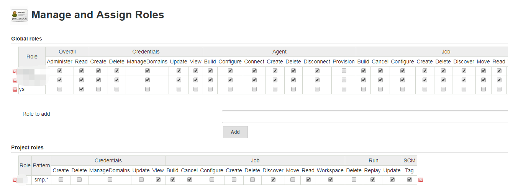
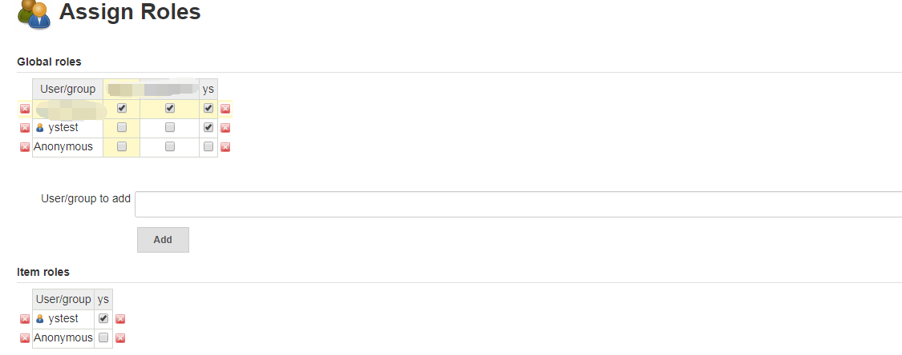
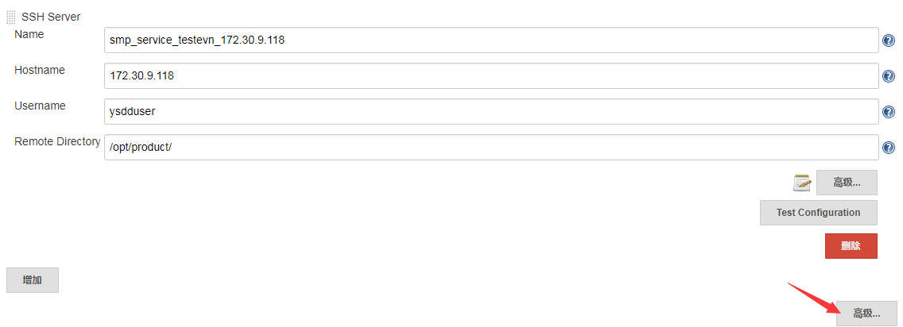

## 多用户多环境的 jenkins 的配置

### jenkins多用户的配置
1. 安装插件`Role-based Authorization Strategy`
2. 在jenkins的`全局安全配置`选择`启用安全`并在授权策略里选中`Role-Based Strategy`。
3. 新建一个用户，用于分配指定项目的权限
1. 进入jenkins系统设置页面，点击进入`Manage and Assign Roles`页面设置,此选择必须装有上面插件后才能显示.
1. 点击进入`Manage Roles`配置,进行如下配置

1. 点击进入`Assign Roles`页面,进入如下配置

此插件的匹配规则是按项目名进行正则匹配的,在命令item的时候注意项目名的命名.
### jenkins多环境的配置
1. 安装插件`SSH Slaves plugin`用户远程上传文件到指定服务器.
1. 配置构建需要的服务器,进入jenkins的系统配置选项页面,找到`Publish over SSH`选项增加一台远程服务器,进行如下配置
####  注意事项
1. 密码或免验证密钥在高级里设置,
1. 远程目录要特别注意一下,要有相应权限,如果没有权限时先进入家目录再做其它,如果目录有相应权限,则SSH到目标服务器里后继其它操作则是直接在远程目录内操作
### jenkins 多编译环境设置
项目一多,不可避免会遇到多JDK版本的项目,如果用Jenkins编译,则需要设置相应的JDK
