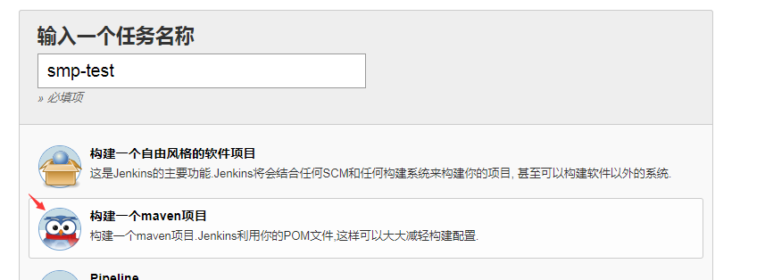
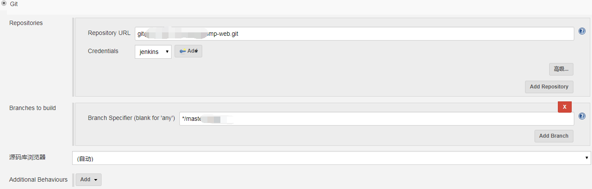
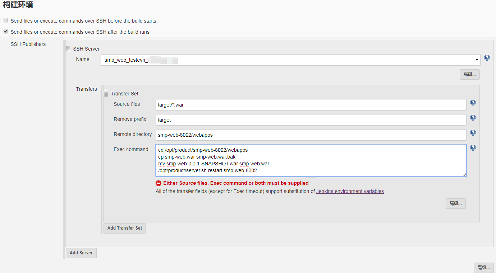
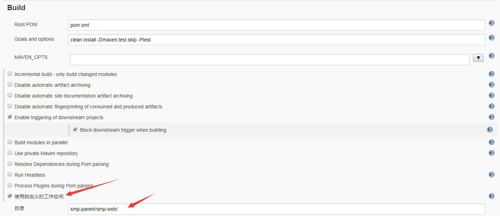
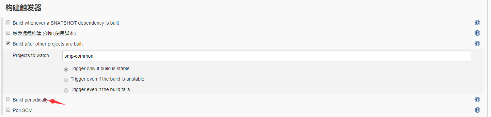
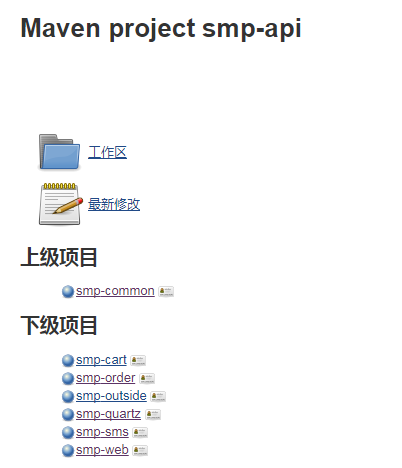

## 新建及配置Item 
### 新建Item
点击Jenkins中的`新建Item`项,在新弹出的页面内输入一个任务名字,注意与前面你想的权限控制的正则匹配,在下面快速选择默认配置项选中`构建一个maven项目`,然后点击确定,进入配置项


,
#### 如果你有相似项目,可以用快速复制方式来创建.
### 配置
#### `General`中选择构建时所用的JDK版本;
#### `源码管理`选中你的源码管理方式,这里使用的是git,填写git地址与构建分支



#### `构建环境`中配置你需要远程发部的服务器信息




> 注意:这里的行程路径与开始配SSH全局设置的远程是相互影响的,全局为工作空间,这里的路径是指工作空间下的相对路径,这点包括Jenkins自身都是类似的机制,需要拷贝文件的路径也是类似,在Jenkins的工作空间的基础上的相对路径.

#### `Biuld`配置如下图,maven命令

```
clean install -Dmaven.test.skip -Ptest
```
-D后为跳出测试的周期,-P后为不同环境的环境参数,注意两者之间都没有空格



> 注意在特殊项目时,比如多模块的`Maven`项目,子模块需要构建在父工程的目录下,需要使用`自定义的工作空间`,这里也是指相对路径,只写父项目的路径下的工程名就好,但必须与`pom.xml`文件的名字一样,不然容易报错.

#### 上下游项目的配置
项目之间有依赖的,必选是上游所依赖的项目构建完成时才能构建当前项目,这时需要配置上下游项目的依赖
在`构建触发器`内选中`Build after other projects are built`,选择填写对应的上游项目,这样构建上游的项目后自动构建下游项目


整个项目的有比较完整的上下游关系时,只需要构建最上游的项目,则会自动构其下游的项目


