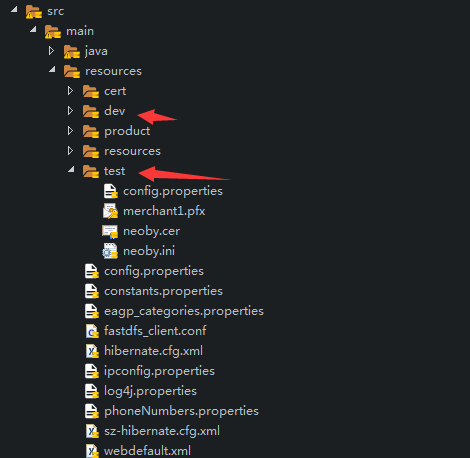

# 工程代码及POM的配置

> 因原项目是单环境,在项目的工程结构和POM文件中均没有相关配置,有些配置项还是写死在代码中的,因为这里需要把相关配置移到配置文件中,并在POM中构建相应的资源

## 工程结构的改变

在原工程目录的resources目录下添加对应环境的文件夹,把对应需要的资源文件放在对应的文件夹内,如下所示,在test文件下放在测试环境对应的配置文件和相关证书


## POM文件修改

### 添加profile属性

在POM.XML文件下的`profiles`节点下添加以下代码,代表三个环境的变量

```xml
		<profile>
			<!-- 本地开发环境 -->
			<id>dev</id>
			<properties>
				<profiles.active>dev</profiles.active>
			</properties>
			<activation>
				<activeByDefault>true</activeByDefault>
			</activation>
		</profile>

		<profile>
			<!-- 测试环境 -->
			<id>test</id>
			<properties>
				<profiles.active>test</profiles.active>
				<maven.resources.overwrite>true</maven.resources.overwrite>
			</properties>
		</profile>
		<profile>
			<!-- 生产环境 -->
			<id>product</id>
			<properties>
				<profiles.active>product</profiles.active>
				<maven.resources.overwrite>true</maven.resources.overwrite>
			</properties>
		</profile>

```
> `activeByDefault`标签为默认值,`maven.resources.overwrite`标签`true`值是代表覆盖原文件

### 拷贝对应环境的resources资源文件

在POM.XML文件下的`resources`节点下添加以下代码,代表对资源文件的操作,每个`resoure`节点都是一个单独的操作,因原POM使用的一个ANT插件用来拷贝证书到特定的目录,这里单独配了一个.

``` xml
           <resource>
				<directory>src/main/resources</directory>
				<includes>
					<include>**/*.properties</include>
					<include>**/*.xml</include>
					<include>**/*.conf</include>
				</includes>
			</resource>
			<!-- 此处功能为原ant插件的功能，拷贝证书到指定路径 -->
			<resource>
				<targetPath>${project.build.directory}/${project.build.finalName}</targetPath>
				<directory>src/main/resources/${profiles.active}</directory>
				<excludes>
					<exclude>**/*.properties</exclude>
					<exclude>**/*.xml</exclude>
					<exclude>**/*.conf</exclude>
				</excludes>
			</resource>
			<!-- 拷贝指定环境的配置文件到替换resources里的配置文件 -->
			<resource>
				<directory>src/main/resources/${profiles.active}</directory>
				<includes>
					<include>**/*.properties</include>
					<include>**/*.xml</include>
					<include>**/*.conf</include>
				</includes>
			</resource>

```

> 注意拷贝路径以及`include`和`exclude`的合理使用

## 修改工程代码配合后续测试操作

### 在测试配置文件添加环境信息

在test/config.propreties内添加变量

```
env=test
```
### 在环境公共类中添加对环境的判断

原工程开发在异常时返回了`true`值,感觉比较奇葩,但getProperty方法做了异常处理返回空字符串,暂时没理它.

```
	public static boolean isTest() {
		try {
			return "test".equalsIgnoreCase(CONFIG_CACHE.getProperty("env"));
		} catch (Exception e) {
			return flase;
		}
	}

```
### 修改测试环境的特殊需求

比如测试环境不想要验证码,特别是我做的性能测试,对验证码什么的最不需要了,在原来的验证Action中修改相关代码,用一个固定的验证码方便后续测试
```java
		// 如果当前环境是测试环境，则验证码为固定值"0000"
		if (ConfigUtils.isTest()) {
			for (int i = 0; i < 4; i++) {
				validateCode += "0";
				g.setColor(new Color(20 + random.nextInt(110), 20 + random.nextInt(110), 20 + random.nextInt(110)));
				g.drawString("0", 13 * i + 15, 18);
			}

		} else {

			for (int i = 0; i < 4; i++) {
				int a = random.nextInt(codeList.length() - 1);
				String rand = codeList.substring(a, a + 1);
				validateCode += rand;
				g.setColor(new Color(20 + random.nextInt(110), 20 + random.nextInt(110), 20 + random.nextInt(110)));

				g.drawString(rand, 13 * i + 15, 18);
			}
		}
```
到此,环境及自动构建工作可以暂时告一段落了,后续改动只涉及细节调整.